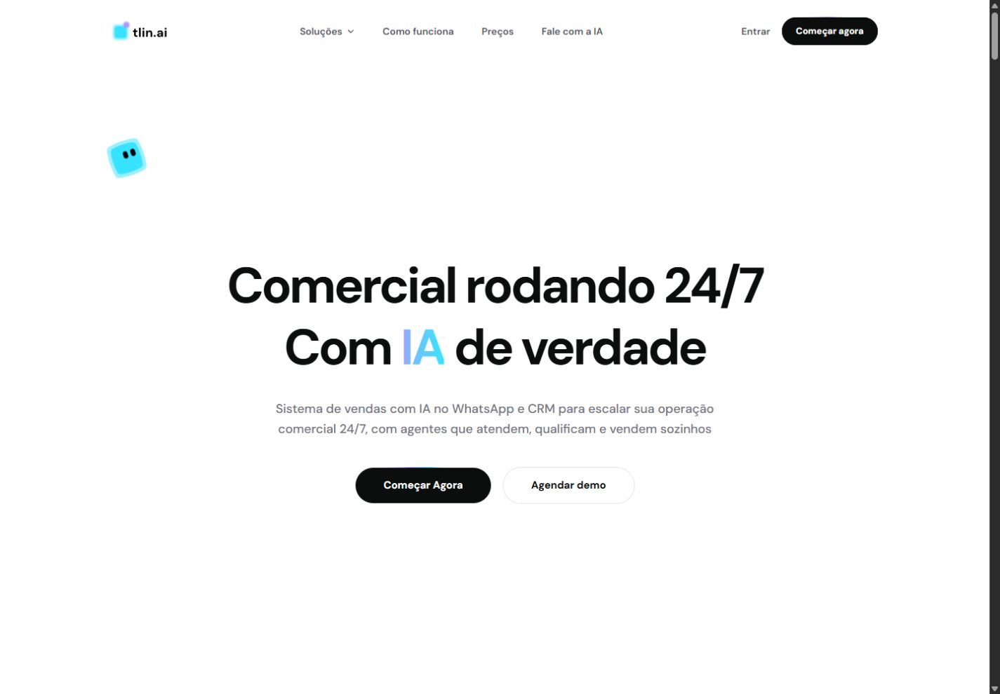

# Referência visual — 17/09/2026

Capturas reais do site local, em português, sem dados de leads. Referência de
design do código `27b26cf`; parte das capturas foi feita após o build da fase 1,
cuja única mudança de interface é o mecanismo de navegação do link da Lia.
Nenhuma classe, layout, texto ou token visual foi alterado nesta fase.

## Condições

- Navegador integrado do Codex, site servido com `next start` em `127.0.0.1:3100`.
- Viewports CSS: desktop **1440 × 1000**; mobile **390 × 844**.
- Dimensões dos PNGs exportados: **1425 × 990** e **375 × 812** nas páginas
  com scrollbar; as capturas de `/demo` têm **1440 × 1000** e **390 × 844**.
  Compare também as dimensões do arquivo, não apenas o viewport solicitado.
- Mobile significa viewport reduzido: não é uma validação em aparelho real,
  emulação de touch ou teste do teclado virtual.
- Capturas da primeira viewport; seções abaixo da dobra não estão cobertas.
- Animações, mascote, carrosséis e contador de oferta permaneceram ativos.
  Seu instante exato não deve ser usado como diferença visual determinística.
- Estado de preços mensal; modal da Lia no início; demo na tela de boas-vindas.
- Nenhum formulário foi preenchido ou enviado. Não há comprovação de agenda,
  disponibilidade, envio de e-mail ou configuração de analytics nestas capturas.

## Arquivos

| Rota/estado | Desktop | Mobile |
| --- | --- | --- |
| Home `/` | [Imagem](visual/2026-09-17/home-desktop.png) | [Imagem](visual/2026-09-17/home-mobile.png) |
| Campanha `/ia-whatsapp` | [Imagem](visual/2026-09-17/campanha-desktop.png) | [Imagem](visual/2026-09-17/campanha-mobile.png) |
| Preços `/precos`, mensal | [Imagem](visual/2026-09-17/precos-desktop.png) | [Imagem](visual/2026-09-17/precos-mobile.png) |
| Demo `/demo`, boas-vindas | [Imagem](visual/2026-09-17/demo-desktop.png) | [Imagem](visual/2026-09-17/demo-mobile.png) |
| Home, menu aberto | — | [Imagem](visual/2026-09-17/menu-mobile.png) |
| Home, Lia aberta | [Imagem](visual/2026-09-17/lia-desktop.png) | — |

## Como usar e atualizar

1. Compare a mesma rota, idioma, viewport, scroll e estado de interação.
2. Observe hierarquia, quebras de título, espaçamento, largura de CTA, bordas,
   gradiente, posição da navegação e visibilidade das ações.
3. Para mudanças abaixo da dobra ou em outros estados, capture também a área
   afetada. Este conjunto não substitui essa verificação.
4. Use a pasta datada como histórico. Para uma nova referência, crie outra pasta
   e documente commit, viewport, estado, mudança esperada e motivo.
5. Não aprove automaticamente um visual só porque apareceu na captura: problemas
   conhecidos de contraste, foco e semântica continuam no backlog das fases 4/5.

Na fase do design system, o catálogo deverá renderizar os componentes reais e
mostrar os estados de hover, foco, carregamento, erro, disabled e movimento reduzido.
Estas imagens são uma referência de revisão manual, não testes automáticos de pixels.

